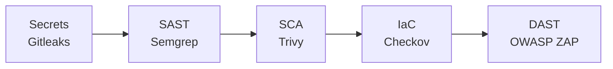

# crAPI Secure Delivery

**Status: Actively in progress.** This is a working DevSecOps + AppSec
portfolio project, updated as work continues. It's not a finished case
study. Everything below is real and verifiable in this repo's commit
history and GitHub Actions runs, not a plan.

## What this is

A gated CI/CD security pipeline built around [OWASP crAPI](https://github.com/OWASP/crAPI)
(an intentionally vulnerable API), paired with hands-on manual vulnerability
research against the same target. The goal: show both halves of AppSec
engineering. Building the automated tooling that catches known-pattern
issues at scale, _and_ doing the manual analysis that finds the
business-logic flaws automated tools structurally can't.

## The target application

crAPI simulates a car dealership/ownership platform: a fictional
"mypremiumdealership.com." It's split into four independently-built
services sharing one login, each a distinct trust boundary and each written
in a different stack (Java/Spring, Go, Python/Django, Python/Flask):

| Service     | Stack              | Responsibility                                   |
| ----------- | ------------------ | ------------------------------------------------ |
| `identity`  | Java (Spring Boot) | Auth, user accounts, vehicle ownership           |
| `community` | Go                 | Social features (posts, comments, video uploads) |
| `workshop`  | Python (Django)    | Mechanic/service requests, shop, coupons         |
| `chatbot`   | Python (Flask)     | LLM-backed support assistant                     |

Plus a gateway service, MongoDB, PostgreSQL, and a vector DB (ChromaDB) for
the chatbot. Each service is a separate trust boundary, which is exactly
why authorization bugs (BOLA, BFLA) are so common here. Consistency across
independently-built services is hard, and that inconsistency is the whole
point of crAPI as a training target.

## What's done so far

**Gated CI/CD pipeline:** 5 stages, each policy-driven (not just
"scanner ran"), each proven to both block and pass correctly:

- Every stage reads a single policy file (`security/policy.yml`) that
  defines severity thresholds and documented, justified suppressions, not
  hardcoded pass/fail logic per tool.
- 11 real secrets findings triaged individually (traced to source, verified
  via `openssl`, decoded JWT expiry), not blanket-suppressed.
- Vendored third-party code is scoped out of blocking (with a documented
  rationale) so the gate reflects risk in code that's actually actionable,
  not pre-existing debt in a pinned dependency.
- Results are visible on every CI run's summary page, not buried in logs.

**Baseline established, before any tuning:**

| Tool      | Layer   | Raw findings                        |
| --------- | ------- | ----------------------------------- |
| Gitleaks  | Secrets | 11                                  |
| Semgrep   | SAST    | 111                                 |
| Trivy     | SCA     | 220 (7 Critical / 108 High)         |
| Checkov   | IaC     | 454 (informational, vendored infra) |
| OWASP ZAP | DAST    | 37                                  |

**Manual vulnerability research, in progress.** Ten confirmed findings
so far, spanning distinct vulnerability classes:

| ID                               | Vulnerability                                                          | CVSS 3.1       | Risk Rating |
| -------------------------------- | ---------------------------------------------------------------------- | -------------- | ----------- |
| [FIND-001](research/FIND-001.md) | BOLA: vehicle location disclosure                                      | 6.5 (Medium)   | High        |
| [FIND-002](research/FIND-002.md) | SSRF: token leak + internal network pivot                              | 7.7 (High)     | Critical    |
| [FIND-003](research/FIND-003.md) | BFLA+BOLA: cross-user video deletion                                   | 6.5 (Medium)   | High        |
| [FIND-004](research/FIND-004.md) | BOPLA: PII + vehicleId exposure in posts                               | 6.5 (Medium)   | High        |
| [FIND-005](research/FIND-005.md) | BFLA + missing input validation: unrestricted coupon creation          | 6.5 (Medium)   | High        |
| [FIND-006](research/FIND-006.md) | User enumeration via signup, no rate limiting                          | 5.3 (Medium)   | High        |
| [FIND-007](research/FIND-007.md) | Login enumeration + missing rate limiting (brute-force)                | 5.3 (Medium)   | Critical    |
| [FIND-008](research/FIND-008.md) | Forget-password enumeration, third instance of the pattern             | 5.3 (Medium)   | High        |
| [FIND-009](research/FIND-009.md) | Full account takeover via unthrottled legacy OTP endpoint              | 9.1 (Critical) | Critical    |
| [FIND-010](research/FIND-010.md) | Unhandled exception disclosure on check-otp, fourth enumeration oracle | 5.3 (Medium)   | High        |

**FIND-009 is the standout result**: a complete, end-to-end account
takeover, not a theoretical path to one. A legacy API version
(`/v2/check-otp`) left live alongside its correctly-secured replacement
(`/v3/check-otp`) has no lockout on OTP guessing. The full chain, trigger
a password reset, brute-force the 4-digit OTP (confirmed via a real
10,000-value sweep, match found after 4,612 attempts), set a new
password, and log in as the victim, was carried out against a real test
account, with a valid session token as final proof.

FIND-004 chains directly into FIND-001. The vehicleId it leaks can be fed
straight into FIND-001's BOLA bug to pull a target's live location,
demonstrating that individually-scored findings can combine into a more
severe real-world attack path, documented explicitly in FIND-004's
writeup rather than left implicit. FIND-006, FIND-007, FIND-008, and
FIND-010 are four independent enumeration oracles for the same
underlying account data, confirming the same weakness exists across
signup, login, forget-password, and OTP verification alike, a systemic
gap rather than four unrelated bugs.

Every finding includes full reproduction steps, request/response
evidence, CVSS scoring, CWE mapping, and an OWASP Risk Rating
likelihood/impact breakdown. See
[`research/methodology.md`](research/methodology.md) for the framework
used.

## What's next

- [ ] Continued route-by-route testing, working through the full API
      surface systematically (tracked in `research/candidates.md`)
- [ ] Remediation: real code fixes + before/after verification per finding
- [ ] Detection feedback loop: a custom rule per finding, wired into the
      pipeline, proven to catch regressions via revert testing
- [ ] Final report comparing baseline vs. remediated state

## Explore it yourself

- [GitHub Actions](../../actions): every pipeline run, gated and real
- [`security/policy.yml`](security/policy.yml): the single source of
  truth for what blocks a build and why
- [`reports/baseline-report.md`](reports/baseline-report.md): full
  ungated baseline with methodology notes
- [`research/methodology.md`](research/methodology.md): CVSS/CWE/OWASP
  Risk Rating framework used for every finding

## Scope & authorization

All testing is performed exclusively against a local, self-deployed
instance of crAPI that I own and control. No shared or public instance is
targeted. See `research/FIND-XXX.md` files for per-finding scope statements.

## Stack

OWASP crAPI, GitHub Actions, Gitleaks, Semgrep, Trivy, Checkov, OWASP ZAP,
Docker Compose
