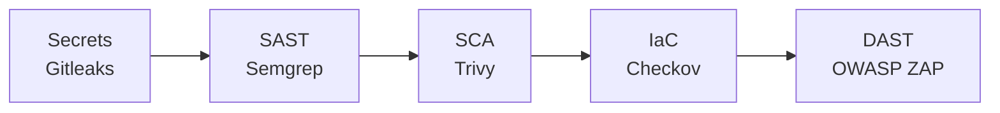

# crAPI Secure Delivery

**Status: Actively in progress.** This is a working DevSecOps + AppSec
project, updated as work continues. It is not a finished case study.
Everything below is real and verifiable in this repo's commit history and
GitHub Actions runs, not a plan.

## What this is

A gated CI/CD security pipeline built around [OWASP crAPI](https://github.com/OWASP/crAPI)
(an intentionally vulnerable API), paired with hands-on manual vulnerability
research against the same target. The goal: show both halves of AppSec
engineering i.e building the automated tooling that catches known-pattern
issues at scale, _and_ doing the manual analysis that finds the
business-logic flaws automated tools structurally can't.

## The target application

crAPI simulates a car dealership/ownership platform, a fictional
"mypremiumdealership.com." It's split into four independently-built
services sharing one login, each a distinct trust boundary and each written
in a different stack (Java/Spring, Go, Python/Django, Python/Flask):

| Service     | Stack              | Responsibility                                   |
| ----------- | ------------------ | ------------------------------------------------ |
| `identity`  | Java (Spring Boot) | Auth, user accounts, vehicle ownership           |
| `community` | Go                 | Social features - posts, comments, video uploads |
| `workshop`  | Python (Django)    | Mechanic/service requests, shop, coupons         |
| `chatbot`   | Python (Flask)     | LLM-backed support assistant                     |

Plus a gateway service, MongoDB, PostgreSQL, and a vector DB (ChromaDB) for
the chatbot. Each service is a separate trust boundary, which is exactly
why authorization bugs (BOLA, BFLA) are so common here. Consistency across
independently-built services is hard, and that inconsistency is the whole
point of crAPI as a training target.

## What's done so far

**Gated CI/CD pipeline** - 5 stages, each policy-driven (not just
"scanner ran"), each proven to both block and pass correctly:

- Every stage reads a single policy file (`security/policy.yml`) that
  defines severity thresholds and documented, justified suppressions,
  not hardcoded pass/fail logic per tool.
- 11 real secrets findings triaged individually (traced to source, verified
  via `openssl`, decoded JWT expiry), not blanket-suppressed.
- Vendored third-party code is scoped out of blocking (with a documented
  rationale) so the gate reflects risk in code that's actually actionable,
  not pre-existing debt in a pinned dependency.
- Results are visible on every CI run's summary page, not buried in logs.

**Baseline established, before any tuning:**

| Tool      | Layer   | Raw findings                        |
| --------- | ------- | ----------------------------------- |
| Gitleaks  | Secrets | 11                                  |
| Semgrep   | SAST    | 111                                 |
| Trivy     | SCA     | 220 (7 Critical / 108 High)         |
| Checkov   | IaC     | 454 (informational, vendored infra) |
| OWASP ZAP | DAST    | 37                                  |

**Manual vulnerability research — in progress.** First fully-documented
finding:

- **FIND-001** - Broken Object Level Authorization (CWE-639) allowing any
  authenticated user to retrieve another user's live vehicle GPS location,
  name, and email. CVSS 3.1: **6.5 (Medium)**. OWASP Risk Rating: **High**
  (see [`research/FIND-001.md`](research/FIND-001.md) for full reproduction
  steps, evidence, and scoring rationale).

## What's next

- [ ] Additional findings (SSRF lead identified, JWT forgery and SQL
      injection candidates already flagged by automated tooling)
- [ ] Remediation: real code fixes + before/after verification per finding
- [ ] Detection feedback loop: a custom rule per finding, wired into the
      pipeline, proven to catch regressions via revert testing
- [ ] Final report comparing baseline vs. remediated state

## Explore it yourself

- [GitHub Actions](../../actions) — every pipeline run, gated and real
- [`security/policy.yml`](security/policy.yml) — the single source of
  truth for what blocks a build and why
- [`reports/baseline-report.md`](reports/baseline-report.md) — full
  ungated baseline with methodology notes
- [`research/methodology.md`](research/methodology.md) — CVSS/CWE/OWASP
  Risk Rating framework used for every finding

## Scope & authorization

All testing is performed exclusively against a local, self-deployed
instance of crAPI that I own and control. No shared or public instance is
targeted. See `research/FIND-XXX.md` files for per-finding scope statements.

## Stack

OWASP crAPI · GitHub Actions · Gitleaks · Semgrep · Trivy · Checkov ·
OWASP ZAP · Docker Compose
